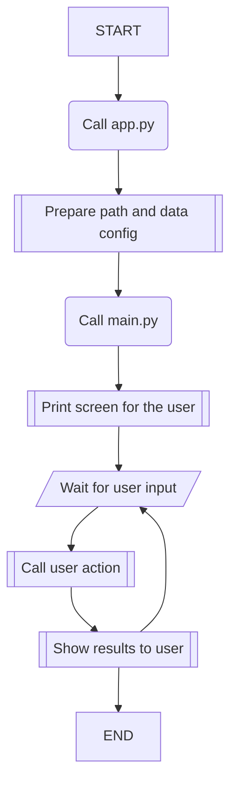

# Control-Migración

Aplicación de **consola** para el registro y control de ingresos migratorios al país.

## Diagrama de uso principal de la aplicación:

## Estructura de carpetas

- **data** [Registro de data .csv]
- **docs** [Archivos .md con documentación complementaria]
- **src** [Código del proyecto]
  - _classes_ [Paquete con las clases principales de la app]
  - _core_ [Paquete con las funcionalidades principales de la app]
  - _utils_ [Paquete con utilities de uso regular]
  - _config.py_ [archivo con configuración inicial de app]
  - _main.py_ [archivo con el código de gestión principal de la app]
- **migra.py** [Entry point de la app]

## Otra documentación

1. [Data](docs/data.md)
2. [Clases internas](docs/classes.md)
3. [Procesos](docs/processes.md)

---
