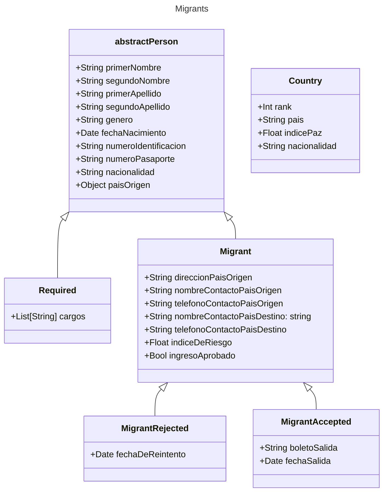
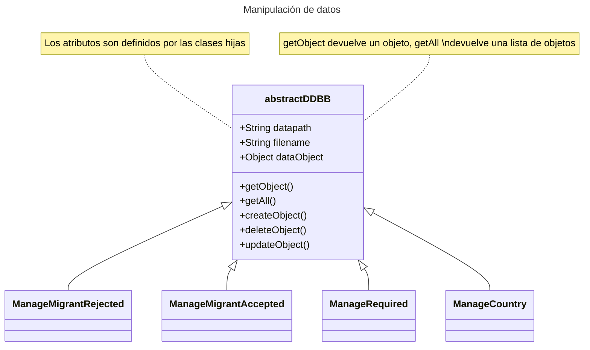
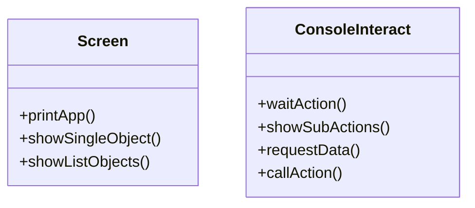

# Clases

## Clases que representan datos

```mermaid
---
title: Migrants
---
classDiagram
    abstractPerson <|-- Required
    abstractPerson <|-- Migrant
    Migrant <|-- MigrantRejected
    Migrant <|-- MigrantAccepted

    class abstractPerson{
        +String primerNombre
        +String segundoNombre
        +String primerApellido
        +String segundoApellido
        +String genero
        +Date fechaNacimiento
        +String numeroIdentificacion
        +String numeroPasaporte
        +String nacionalidad
        +Object paisOrigen
    }

    class Required {
        +List[String] cargos
    }

    class Migrant{
        +String direccionPaisOrigen
        +String nombreContactoPaisOrigen
        +String telefonoContactoPaisOrigen
        +String nombreContactoPaisDestino: string
	    +String telefonoContactoPaisDestino
        +Float indiceDeRiesgo
        +Bool ingresoAprobado
    }

    class MigrantRejected{
        +Date fechaDeReintento
    }

    class MigrantAccepted{
        +String boletoSalida
        +Date fechaSalida
    }

    class Country {
        +Int rank
        +String pais
        +Float indicePaz
        +String nacionalidad
    }
```

## Clases para gestión de datos

```mermaid
---
title: Manipulación de datos
---
classDiagram
    abstractDDBB <|-- ManageMigrantRejected
    note for abstractDDBB "Los atributos son definidos por las clases hijas"
    note for abstractDDBB "getObject devuelve un objeto, getAll \ndevuelve una lista de objetos"
    abstractDDBB <|-- ManageMigrantAccepted
    abstractDDBB <|-- ManageRequired
    abstractDDBB <|-- ManageCountry
    class abstractDDBB{
        +String datapath
        +String filename
        +Object dataObject
        +getObject()
        +getAll()
        +createObject()
        +deleteObject()
        +updateObject()
    }


```

## Clase para visualización e interacción

```mermaid
classDiagram
    class Screen{
        +printApp()
        +showSingleObject()
        +showListObjects()
    }
    class ConsoleInteract{
        +waitAction()
        +showSubActions()
        +requestData()
        +callAction()
    }
```
