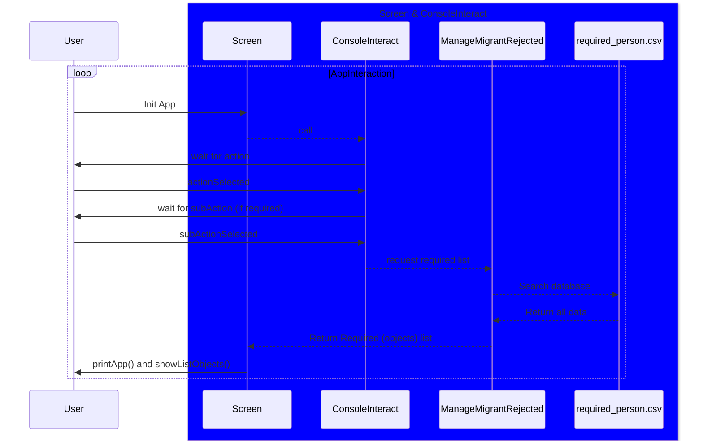

# Procesos e interacción

## Example: Solicitar lista de requisitoriados

```mermaid
sequenceDiagram

    participant User
    box Blue Screen & ConsoleInteract
    participant Screen
    participant ConsoleInteract
    participant ManageMigrantRejected
    participant required_person.csv
    end
    loop AppInteraction
        User->> Screen: Init App
        Screen-->> ConsoleInteract: call
        ConsoleInteract ->> User: wait for action
        User ->> ConsoleInteract: actionSelected
        ConsoleInteract ->> User: wait for subAction (if required)
        User ->> ConsoleInteract: subActionSelected
        ConsoleInteract -->> ManageMigrantRejected: request required list
        ManageMigrantRejected -->> required_person.csv: Search database
        required_person.csv -->> ManageMigrantRejected: Return all data
        ManageMigrantRejected -->> Screen: Return Required (objects) list
        Screen ->> User: printApp() and showListObjects()
    end

```
